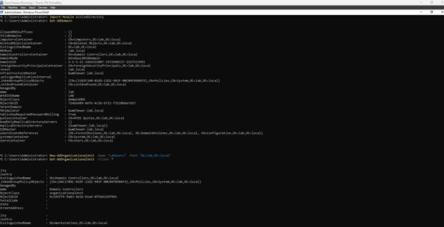
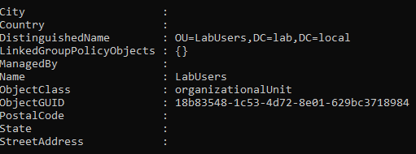
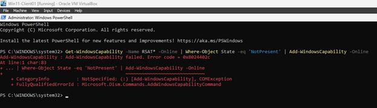
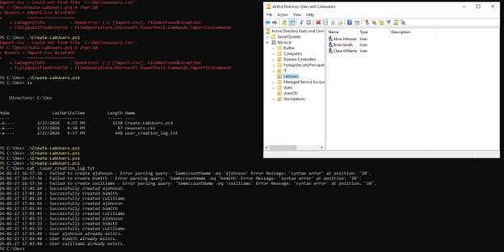

# Project Journal – AD Bulk User Provisioning Script

## Objective

Develop and test a PowerShell automation script to bulk-create Active Directory users from a CSV file in a controlled lab environment.

---

## Lab Environment

- 1 Domain Controller (Windows Server)
- 2 Domain-Joined Client VMs
- Domain: lab.local
- Target OU: LabUsers
- Isolated network (no internet access)

---

## Step 1 – Organizational Unit Creation

Before provisioning users, a dedicated OU was created to isolate test accounts.



Verification of OU creation:



This ensures:
- Controlled test scope
- Separation from default containers
- Safer automation validation

---

## Step 2 – RSAT Installation Attempt

Attempted to install RSAT on a domain-joined client machine.

Encountered error due to isolated lab network:



Root Cause:
- No internet access
- No WSUS configured
- Windows Update unable to retrieve capability packages

Resolution:
- Continued development directly on the Domain Controller within lab constraints
- Documented best practice: in production, scripts should run from a management workstation

---

## Step 3 – Script Development & Testing

### Initial Execution

Script imported CSV data and attempted to create users.

First run revealed an AD filter syntax error:
- Incorrect variable expansion in `Get-ADUser -Filter`

Issue corrected by updating filter syntax to:

```
Get-ADUser -Filter "SamAccountName -eq '$($username)'"
```

---

## Step 4 – Successful Execution

After correcting the filter syntax:

- Dry-run mode validated logic flow
- Live execution created users successfully
- Re-run confirmed duplicate detection logic worked

Successful user creation:



---

## Script Capabilities

- Imports CSV (FirstName, LastName, Department)
- Generates SamAccountName (first initial + last name)
- Generates UPN (username@lab.local)
- Assigns temporary password
- Creates user in OU=LabUsers
- Logs all events with timestamps
- Skips existing users (idempotent behavior)

---

## Validation Process

Tested:

1. Syntax failure handling (logged correctly)
2. Dry-run execution
3. Live creation
4. Duplicate detection

Logs confirmed:

- Error detection
- Successful creation
- Correct skip behavior when users already exist

---

## Security Considerations

- Temporary passwords assigned
- No GPO linked to LabUsers OU yet
- No production data involved
- In enterprise:
  - Use management workstation
  - Avoid direct DC development
  - Implement least privilege
  - Randomize passwords

---

## Lessons Learned

- AD filter syntax must be properly quoted and expanded
- Logging is critical for safe automation
- Dry-run mode prevents accidental directory modification
- Lab constraints impact architectural decisions
- Idempotent scripting improves reliability

---

## Future Improvements

- Random password generation
- Force password change at next logon
- Group assignment by department
- Parameterize OU and domain
- Add WhatIf and Verbose support
- Convert into reusable PowerShell module

---

## Career Relevance

This project demonstrates:

- Active Directory automation
- Structured troubleshooting
- Logging discipline
- Secure infrastructure thinking
- Systems Engineering practices
